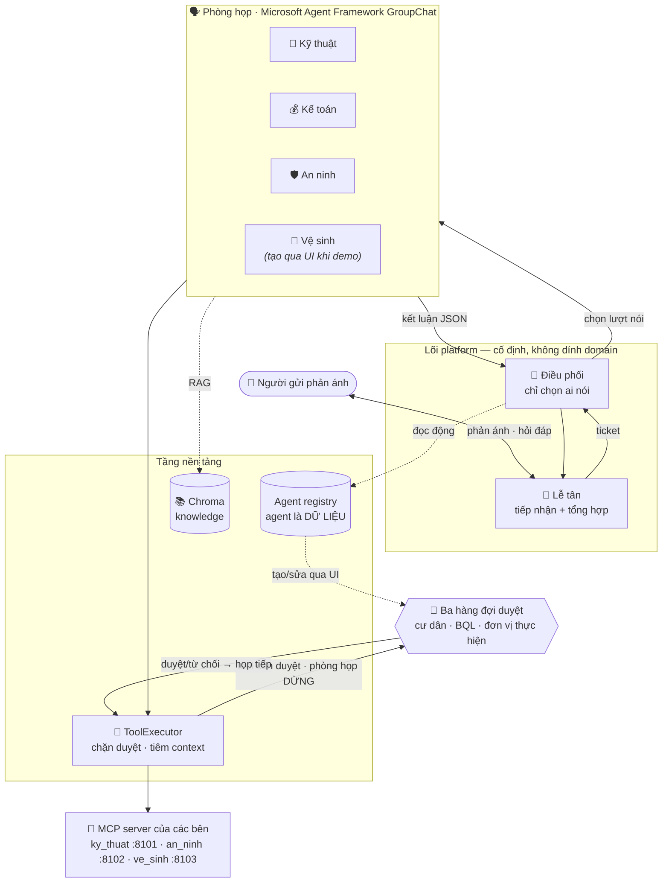

# Platform phòng họp agent — bản demo khả thi

Demo kiểm chứng một platform xử lý phản ánh bằng nhiều AI agent, áp dụng cho Ban quản lý
tòa nhà. Điểm cốt lõi cần chứng minh: **quản lý tạo được agent chuyên môn mới hoàn toàn qua
giao diện — gắn tool, upload tài liệu, chạy thử, bật lên — và Điều phối tự động chuyển ticket
phù hợp cho agent đó, không sửa một dòng code nào.**

---

## 1. Kiến trúc



**Ba nguyên tắc chi phối toàn bộ thiết kế:**

1. **Lõi không dính domain.** `backend/core/` và `platform_prompt.py` không chứa chữ nào đặc thù
   khách hàng. Mọi từ ngữ riêng đọc từ `domains/<id>/domain.yaml`. Kịch bản 6 grep để kiểm.
2. **Agent là dữ liệu.** Kể cả agent seed cũng được tạo qua chính API mà giao diện builder dùng
   (`scripts/seed.py` gọi HTTP, không ghi thẳng DB).
3. **Duyệt và bảo mật nằm ở tầng tool, không nằm ở prompt.** `ToolExecutor` chặn tool
   `requires_approval` và tiêm `context_params` từ ticket — LLM không có đường vòng. Tool cần
   duyệt còn **dừng cả phòng họp lại** (HITL) cho tới khi quản lý quyết định, xem mục 7.

---

## 2. Yêu cầu

- Python 3.11+ (demo dùng **3.12**; chromadb chưa hỗ trợ 3.14)
- Một API key tương thích OpenAI cho Qwen (DashScope hoặc gateway nội bộ)

## 3. Cài đặt

```bash
cd demo
make install                 # tạo .venv và cài requirements
cp .env.example .env         # rồi mở .env điền QWEN_API_KEY
```

### Cấu hình Qwen trong `.env`

```bash
QWEN_API_KEY=sk-...
# Quốc tế: https://dashscope-intl.aliyuncs.com/compatible-mode/v1
# Trung Quốc: https://dashscope.aliyuncs.com/compatible-mode/v1
QWEN_BASE_URL=https://dashscope-intl.aliyuncs.com/compatible-mode/v1
QWEN_CHAT_MODEL=qwen-plus            # agent chuyên môn + Lễ tân
QWEN_ROUTER_MODEL=qwen-plus          # Điều phối (đổi model rẻ hơn được)
QWEN_EMBED_MODEL=text-embedding-v3
EMBED_DIM=1024
ROOM_ENGINE=maf                      # maf | builtin
HITL_WAIT_FOR_APPROVAL=1             # 1 = phòng họp dừng chờ duyệt (xem mục 7)
HITL_APPROVAL_TIMEOUT=600            # giây; hết hạn thì họp tiếp, hành động vẫn chờ duyệt
INTAKE_MAX_TURNS=3                   # quá số lượt này thì Lễ tân mở phản ánh, thôi hỏi
```

**Kiểm tra cấu hình trước khi chạy gì khác:**

```bash
make check      # hoặc: .venv/bin/python scripts/check_qwen.py
```

Script thử lần lượt: chat thường → function calling → JSON mode → embedding (in số chiều).
Model nào không đạt sẽ hiện FAIL kèm lý do.

## 4. Chạy

```bash
./run.sh        # khởi động MCP server (:8101) + backend (:8000)
```

Mở <http://127.0.0.1:8000> → giao diện 5 tab. Dừng bằng Ctrl+C.

Nếu cổng 8000 đang bị chiếm, script báo lỗi rõ và gợi ý `APP_PORT=8002 ./run.sh`. Nếu MCP server
đã chạy sẵn ở 8101, script dùng lại và không giết nó khi thoát.

Lần đầu, ở cửa sổ khác:

```bash
.venv/bin/python scripts/seed.py         # 3 agent + knowledge, qua HTTP API
.venv/bin/python scripts/smoke_test.py   # 6 kịch bản nghiệm thu
```

### Các script khác

| Lệnh | Việc |
|---|---|
| `scripts/check_qwen.py` | Kiểm 4 năng lực của model đang cấu hình |
| `scripts/spike_maf.py` | Chạy phòng họp GroupChat **không cần API key** (stub LLM) |
| `scripts/seed.py` | Tạo/cập nhật agent seed + nạp knowledge |
| `scripts/smoke_test.py` | 6 kịch bản ở mục 6 |

---

## 5. Kịch bản demo 5 phút

| Phút | Làm gì | Cần chỉ cho người xem thấy |
|---|---|---|
| 0:00 | **Tab 4 — Tool catalog** | 15 tool, cột *Phạm vi* và *Cần duyệt*. `tra_lich_ktv` đến từ `mcp:ky_thuat` — hệ thống của nhóm khác cắm vào qua MCP. Hai tool vệ sinh chưa agent nào dùng. |
| 0:30 | **Tab 1 — Cư dân**: gửi *"Trần nhà tắm nhà tôi nước nhỏ giọt liên tục từ sáng"* | Lễ tân hỏi thêm vị trí, rồi tạo ticket và báo ưu tiên. |
| 1:00 | **Tab 2 — Phòng họp** | Chọn phản ánh ở cột trái → đầu phòng cho biết ngay: vụ gì, căn hộ nào, trạng thái, số lượt đã dùng và **việc tiếp theo**. Tab **Trao đổi** chạy thời gian thực: Điều phối chọn Kỹ thuật **kèm lý do**, tool call hiện `ma_can_ho` **do hệ thống tiêm**. Tab **Nhật ký** giữ nguyên mọi sự kiện thô kèm payload; **Thành viên** tô sáng ai đang phát biểu. |
| 1:45 | Nếu là ca sửa chữa do cư dân chịu phí | Phòng họp chạy 4 lượt: Kỹ thuật phân loại bên chịu chi phí → Kế toán lập **báo giá dự kiến** (`BG-DK-…`) → Kỹ thuật xác nhận vật tư và giờ công → Kế toán **chốt giá cuối** (`BG-CT-…`). Tool tự cộng tiền, model không bịa số. |
| 2:00 | **Tab 5 — BQL duyệt** / **Tab 6 — Đơn vị duyệt** (hoặc băng-rôn vàng ngay trên đầu phòng, hoặc tab **Công việc**) | `dieu_ktv_khan_cap` nằm chờ, **chưa chạy** — và **cả phòng họp đang đứng im**: timeline dừng ở `room_waiting`, không có lượt nào chạy thêm. Bấm **Duyệt và họp tiếp** → tool thực thi, kết quả thật quay vào đúng lượt đang dở, phòng họp chạy nốt rồi Lễ tân mới trả lời cư dân. Bấm **Từ chối** thì agent phải nêu phương án khác. |
| 2:30 | **Tab 3 — Agent Studio**: tạo *"Vệ sinh môi trường"* | Ba giai đoạn hiện rõ trên đầu: mô tả nhu cầu → rà soát cấu hình → chạy thử & bật. Điền mô tả năng lực, chọn 2 tool vệ sinh (khối **Được làm / Cần người duyệt / Không được làm** nói rõ quyền), upload `quy_dinh_ve_sinh.md`. |
| 3:30 | Bấm **Thử định tuyến** với *"Rác tồn đọng ở hành lang tầng 12"* | Điều phối trả về `ve_sinh` — mô tả năng lực đủ rõ. Bấm **Bật**. |
| 4:00 | Quay **Tab 1**, gửi đúng phản ánh về rác | Điều phối tự chọn agent vừa tạo. **Không sửa dòng code nào.** |
| 4:45 | Nhấn mạnh | Agent mới = dữ liệu trong DB. Registry đọc động mỗi lượt. |

**Mẹo:** mở sẵn hai tab trình duyệt (Cư dân và Phòng họp) để chuyển qua lại cho mượt.

---

## 6. Sáu kịch bản nghiệm thu

`scripts/smoke_test.py` chạy tự động qua API và in PASS/FAIL:

1. **Rò nước khẩn cấp** — tạo ticket, Điều phối gọi Kỹ thuật, có tool call, có phiếu sửa chữa
   hoặc hành động chờ duyệt, và câu trả lời của Lễ tân không lộ tên agent/tool.
2. **Thắc mắc phí** — gọi Kế toán, RAG trả `bang_phi_dich_vu.md`, `tra_phi_dich_vu` được gọi với
   `ma_can_ho` đúng căn hộ người báo.
3. **Liên bộ phận** — phòng họp gọi **cả** An ninh **và** Kỹ thuật.
4. **Tạo agent mới** — tạo qua API, upload tài liệu, sandbox router chọn đúng, bật, rồi ticket
   thật về rác được định tuyến tới agent đó.
5. **Bảo mật tham số** — ép agent tra căn hộ khác; log cho thấy `ma_can_ho` vẫn là của người báo.
6. **Lõi sạch domain** — grep `backend/core/` và `platform_prompt.py` không thấy từ khóa domain.

---

## 7. Lõi phòng họp: Microsoft Agent Framework

Phòng họp dựng trên `GroupChatBuilder` của **agent-framework** 1.19.

| Khái niệm platform | Ánh xạ sang framework |
|---|---|
| Agent registry (bảng DB) | `participants` = `agent_framework.Agent` |
| Điều phối (LLM router) | `termination_condition` + `selection_func` |
| Knowledge / RAG | `ContextProvider.before_run` |
| Tool catalog | `FunctionTool(input_model=<schema đã ẩn context params>)` |
| Duyệt + tiêm context | `ToolExecutor` — **giữ ở tầng platform, không giao cho framework** |
| Quan sát từng bước | Hook của ContextProvider → event bus → SSE |

Đổi engine bằng `.env`:

```bash
ROOM_ENGINE=maf       # GroupChat của Agent Framework (mặc định)
ROOM_ENGINE=builtin   # vòng lặp tự viết, backend/core/room.py
```

Giữ cả hai để so sánh trực tiếp và có đường lui. Chi tiết các bẫy đã gặp: xem `DECISIONS.md`.

### Duyệt của quản lý chặn phòng họp (HITL)

Trước đây `requires_approval` chỉ có nghĩa "đừng chạy bây giờ": phòng họp tạo hành động chờ duyệt
rồi **chạy tiếp**, agent kết luận quanh một kết quả tool nó chưa bao giờ nhận, và lệnh duyệt của
quản lý về tới khi phiên họp đã tan. Nay lượt gọi tool **dừng tại chỗ** trong `ToolExecutor`
(`backend/tools/approval_gate.py`), nên việc duyệt là một phần của cuộc họp:

```
agent gọi tool cần duyệt
  → tool_call + action_pending + room_waiting   (ticket → cho_duyet, timeline đứng im)
  → quản lý bấm Duyệt / Từ chối  (băng-rôn ở tab Phòng họp, hoặc tab 5)
  → action_executed + room_resumed              (ticket → dang_xu_ly, họp tiếp)
```

**Ai duyệt là thuộc tính của tool, không phải luật trong code.** Mỗi tool khai `approval_role`
trong `catalog.yaml`; `ToolExecutor` đọc vai trò đó rồi đẩy hành động vào đúng hàng đợi. Các vai
trò do domain pack khai (`approval_roles` trong `domain.yaml`), nên lõi không biết "cư dân" hay
"BQL" là gì:

| Vai trò | Ai bấm | Hiện ở đâu | Ví dụ tool |
|---|---|---|---|
| `cu_dan` | người gửi phản ánh | ngay trong khung chat tab **Cư dân** | `chot_phuong_an_voi_cu_dan`, `cu_dan_xac_nhan_hoan_thanh` |
| `bql` | Ban quản lý | tab **BQL duyệt** | `dieu_ktv_khan_cap`, `dieu_to_an_ninh`, `dieu_to_ve_sinh`, `mien_giam_phi` |
| `don_vi` | kỹ thuật / an ninh / vệ sinh / nhà thầu ngoài | tab **Đơn vị duyệt** (dùng chung) | `ktv_xac_nhan_tiep_nhan`, `an_ninh_bao_hoan_thanh`, `ve_sinh_xac_nhan_tiep_nhan` |

**Quy trình xác nhận 5 bước** khai ở `quy_trinh_xac_nhan` trong `domain.yaml`, mỗi bước khớp bằng
một danh sách tool nên thêm một bên mới chỉ là thêm tool vào đúng bước:

```
① cư dân chốt phương án → ② BQL duyệt điều đơn vị → ③ đơn vị xác nhận tiếp nhận
→ ④ đơn vị báo đã xong → ⑤ cư dân nghiệm thu → mới được đóng phòng
```

Guard `quy_trinh_xac_nhan_chua_xong` trong cả hai engine chặn Điều phối kết thúc phiên khi quy
trình **đã bắt đầu** mà chưa đi hết: nó nhắc lại một lần kèm tên bước còn thiếu. Phản ánh chỉ hỏi
thông tin không bao giờ bước vào quy trình này nên không bị chặn. Trạng thái từng bước xem ở
`GET /api/tickets/{id}/workflow`, và hiện thành dải 5 ô ngay đầu phòng họp.

Agent nhận lại đúng ba trạng thái, và luật phòng họp trong `platform_prompt.py` nói rõ phải làm gì
với từng trạng thái:

| `trang_thai_duyet` | Nghĩa | Agent phải làm |
|---|---|---|
| `da_duyet` | Tool **đã chạy thật**, dữ liệu trong `ket_qua` | Kết luận dựa trên dữ liệu thật đó |
| `tu_choi` | Quản lý không đồng ý, **không có gì xảy ra** | Nêu phương án khác, không được nói là đã làm |
| `cho_duyet` | Hết hạn chờ, chưa có quyết định | Ghi nhận là đang chờ duyệt |

Chi tiết cần biết khi vận hành:

- **Chờ có hạn.** Quá `HITL_APPROVAL_TIMEOUT` (mặc định 600s) thì phòng họp chạy tiếp thay vì treo
  vĩnh viễn. Hành động **vẫn nằm ở hàng chờ**; duyệt muộn vẫn thực thi, chỉ là chạy ngoài phiên họp
  và lúc đó Lễ tân gửi tin cập nhật riêng cho người báo (đúng hành vi cũ).
- **Không chạy hai lần.** `approval_gate.decide()` và `abandon()` dùng chung một lock: quyết định
  về đúng lúc hết hạn thì hoặc phòng họp nhận, hoặc endpoint tự chạy — không bao giờ cả hai.
- **Sandbox và đánh giá không bao giờ chặn.** Vé `is_eval` và Chạy thử ở builder không có ai ngồi
  duyệt; ở đó tool cần duyệt trả `action_id: SANDBOX` như trước.
- **Tắt được.** `HITL_WAIT_FOR_APPROVAL=0` trả lại nguyên hành vi cũ.

### Guard nằm ở code, không nằm ở prompt

| Guard | Xử lý |
|---|---|
| Điều phối chọn agent không có / không active | Nhắc lại **1 lần** kèm danh sách hợp lệ; vẫn sai thì kết thúc |
| Vượt `max_room_turns` | Buộc kết thúc |
| Một agent nói quá 3 lần | Loại khỏi danh sách chọn |
| Agent cần hỏi thêm người báo | Ghim câu hỏi lên ticket, chạy nốt các bộ phận còn việc, rồi mới chuyển Lễ tân; ticket → `cho_cu_dan` |
| Chờ duyệt quá `HITL_APPROVAL_TIMEOUT` | Phát `het_han_cho_duyet`, họp tiếp; hành động vẫn ở hàng chờ |
| Hỏi lại người báo quá `MAX_FOLLOWUP_ROUNDS` vòng, hoặc hỏi lại gần y hệt câu đã được trả lời | Phát `khong_hoi_lai_nguoi_bao`, **bỏ câu hỏi** khỏi kết luận, buộc agent chốt với thông tin đang có |

Mọi guard đều phát sự kiện `guard_triggered` nên nhìn thấy được khi demo.

### Guard ở bước tiếp nhận (Lễ tân)

Lễ tân chạy trước khi ticket tồn tại nên không có timeline; các guard dưới đây ghi log
`WARNING` và sửa ngay tin nhắn trước khi nó đến người báo. Cả ba đều dựng từ `domain.yaml`
(nhãn trường, cách xưng hô), không có chữ nào của khách hàng nằm trong lõi.

| Guard | Vì sao | Xử lý |
|---|---|---|
| Model hứa "cung cấp thêm thông tin:" rồi không hỏi gì | Người báo không biết trả lời gì, hội thoại tắc | Bù câu hỏi từ nhãn các trường còn thiếu |
| Đã đủ trường bắt buộc mà tin nhắn vẫn xin thêm thông tin | Người báo trả lời một câu hỏi đã hết giá trị trong lúc phòng họp đã chạy | Thay bằng câu chốt tiếp nhận |
| Người báo nhắn quá `INTAKE_MAX_TURNS` lượt mà vẫn thiếu trường | Model nhỏ hỏi vòng vo vô hạn; bắt người báo nhắc lại mãi là cách chắc chắn nhất để mất họ | Mở phản ánh với thông tin đã có, trường thiếu ghi rõ "(người báo chưa nêu rõ)" |

Hai thứ khiến Lễ tân bớt hỏi ngay từ đầu, không phải guard mà là sửa đúng gốc:

- **Lễ tân biết người báo là ai.** Tầng API truyền `requester_profile` (tên, mã căn hộ, điện
  thoại, vai trò) vào prompt kèm luật "TUYỆT ĐỐI KHÔNG hỏi lại". Trước đó nó chỉ nhận mã người
  báo trong tham số hàm — không có trong prompt — nên đi hỏi lại đúng những thứ hệ thống đã có.
- **Trường thu thập được cộng dồn qua từng lượt.** Trạng thái tiếp nhận lưu ở
  `ChatMessage.data` và được bơm lại vào prompt mỗi lượt; model quên một trường ở lượt sau thì
  code vẫn giữ (`{**đã_có, **model_trả_về}`).

---

## 7b. Giao diện

Giao diện lấy **hệ thiết kế từ bản `Resident-Local/`** (`offline/bql-ui.css`, `offline/resident-ui.css`)
và áp vào đúng dữ liệu thật của demo — không nhúng bundle React của bản đó, không thêm dependency:

| Tệp | Vai trò |
|---|---|
| `frontend/index.html` | Khung ứng dụng: sidebar 6 khu vực, topbar cho màn hình hẹp |
| `frontend/ui.css` | Token và component port từ Resident-Local (không còn Tailwind) |
| `frontend/app.js` | Toàn bộ logic gọi API, SSE và render (giữ nguyên hợp đồng với backend) |
| `frontend/assets/` | Font Inter `.woff2` và favicon lấy từ `Resident-Local/offline/` |

Hai vùng, hai bộ token, đúng như bản gốc: **cư dân** dùng accent cam đất với thẻ bo tròn 18px,
**bảng điều khiển BQL** dùng nền trung tính với accent navy `#284e93`. Hai điều chỉnh về bố cục
lấy thẳng từ `BQL-UX-RESEARCH.md` của bản đó:

- **Phòng họp = danh sách vụ việc + một vùng làm việc**, thay vì ba cột hẹp. Tóm tắt và “việc tiếp
  theo” luôn nằm ở đầu phòng; bốn tab **Trao đổi / Công việc / Nhật ký / Thành viên** chia thông tin
  theo tác vụ, có badge đếm để thứ đang ẩn không bị quên.
- **Agent Studio ba giai đoạn** thay cho một trang phẳng: mô tả nhu cầu → rà soát cấu hình → chạy
  thử & bật. Chốt chặn đánh giá hiển thị trạng thái thật (“chưa chạy” là chưa chạy), không tô xanh
  trước khi có kết quả.

Mọi nội dung hiển thị vẫn đến từ API thật của demo: không có dữ liệu mẫu cứng trong giao diện.

---

## 8. Các giới hạn đã biết

**Ngoài phạm vi có chủ đích:** không đăng nhập/phân quyền, không multi-tenant, không hybrid
search/rerank, không deploy production, không tích hợp hệ thống thật. Mọi dữ liệu nghiệp vụ là mock.

**Giới hạn kỹ thuật:**

- **Tương thích Responses API.** `OpenAIChatClient` của framework mặc định gọi
  `POST /v1/responses`; endpoint tương thích OpenAI của DashScope không nhận role `tool` ở đó nên
  mọi vòng tool-calling lỗi 400. Demo dùng `OpenAIChatCompletionClient` để đi qua
  `/v1/chat/completions`. Đổi provider thì phải kiểm lại điểm này.
- **Tài liệu MAF lệch bản cài.** Trang learn.microsoft.com mô tả `ChatAgent`, `ai_function`,
  `GroupChatBuilder().participants()`. Bản 1.19 trên PyPI dùng `Agent`, `FunctionTool`, và
  truyền `participants=` / `selection_func=` qua constructor. Phải đọc code cài thật.
- **GroupChat broadcast toàn hội thoại** cho mọi participant, nên agent thấy output thô của nhau;
  engine `builtin` chỉ đưa bản tóm tắt đã chuẩn hóa. Hệ quả: context dài hơn và tốn token hơn
  theo số lượt.
- **Lễ tân kết thúc tiếp nhận theo code, không theo model.** Model nhỏ có xu hướng hỏi mãi, nên
  code chốt: đủ trường bắt buộc là tạo ticket. Đổi `intake_fields` trong `domain.yaml` để điều chỉnh.
- **RAG cơ bản:** một collection Chroma, lọc theo `agent_id`, top-k cố định, ngưỡng khoảng cách
  `RAG_MAX_DISTANCE`. Không rerank, không hybrid search.
- **Ba MCP server mock** (`ky_thuat` :8101, `an_ninh` :8102, `ve_sinh` :8103), mỗi bên một tiến
  trình riêng đúng như hệ thống của ba đơn vị khác nhau. Thêm bên thứ tư (thang máy, cây xanh,
  nhà thầu ngoài): thêm một tệp trong `mcp_servers/`, một dòng trong `MCP_SERVERS` của
  `backend/tools/mcp_client.py`, một dòng trong mảng `MCP_SERVERS` của `run.sh`, và các mục tool
  kèm `approval_role` trong `catalog.yaml` — không sửa dòng code lõi nào.
- **Không có bước build frontend:** HTML + CSS + JS thuần, font Inter nhúng cục bộ trong
  `frontend/assets/` — không tải gì từ CDN nên mở được cả khi máy không ra Internet.
- **SQLite + event bus trong bộ nhớ:** chỉ hợp một tiến trình. Chạy nhiều worker thì SSE sẽ lệch.
- **Chốt chờ duyệt cũng nằm trong bộ nhớ.** Restart backend lúc đang chờ thì phòng họp đó mất;
  hành động vẫn ở `cho_duyet` và duyệt sau vẫn chạy, nhưng phiên họp không tiếp tục được. Mỗi
  phiên đang chờ cũng giữ một luồng trong pool của `asyncio.to_thread` (đã nới lên 48 chỗ
  trong `main.py`) — đủ cho demo, không phải thiết kế cho tải thật.
- **Tool ghi lưu vào bảng mock** (`MockRecord`) và một file JSON phía MCP server; không có nghiệp
  vụ thật phía sau.
